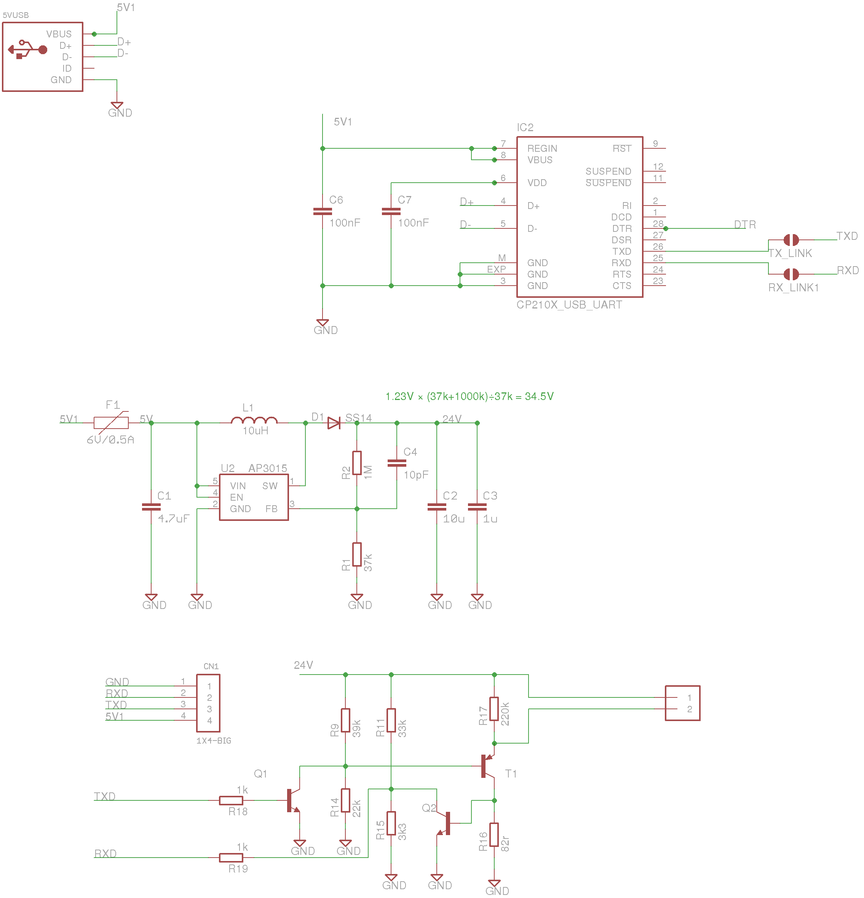
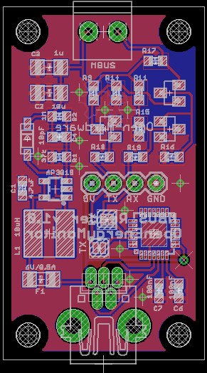

# USB to MBUS

A simple USB MBUS reader with on-board boost converter and CP2102 USB to UART chip. Designed for reading data from heat pump heat meters and interfacing directly with a RaspberryPi via a USB cable.

**Features**

- MBUS Reader circuit (original circuit by [Tomas Menzi](https://github.com/rscada/libmbus/tree/master/hardware))
- On-board boost converter (based on [Taaralabs](https://taaralabs.eu/m-bus-uart-converter/))
- CP2102 USB to UART chip

**Software**

The board can be used with the EmonHub MBUS Interfacer. This interfacer is designed to look for specific useful parameters for electric and heat metering (It does not implement the full MBUS spec). It will typically return flow and return temperatures, flow rate, heat output, and cumulative heat energy for heat meters that support these parameters.

https://guide.openenergymonitor.org/integrations/emonhub-interfacers/#mbus-reader-for-electric-and-heat-meters

## Schematic

[USB_to_MBUS.sch](USB_to_MBUS.sch)

## Board

[USB_to_MBUS.brd](USB_to_MBUS.brd)

The hardware design (schematics, board files and gerber) files are licensed under the [Creative Commons Attribution-ShareAlike 3.0 Unported License](http://creativecommons.org/licenses/by-sa/3.0/) and follow the terms of the [OSHW (Open-source hardware) Statement of Principles 1.0.](http://freedomdefined.org/OSHW)

