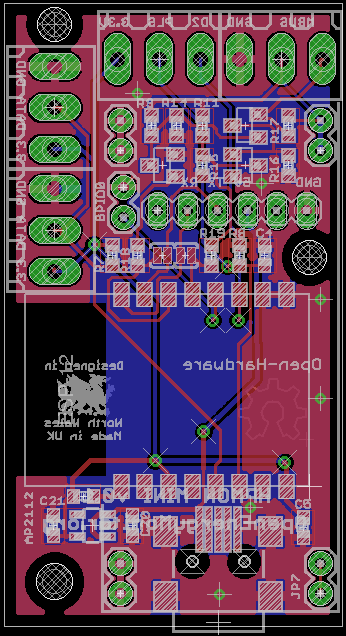

# WiFi MBUS Reader

## Schematic

[WiFi_MBUS_Reader.brd](WiFi_MBUS_Reader.brd)

## Board

[WiFi_MBUS_Reader.sch](WiFi_MBUS_Reader.sch)

The hardware design (schematics, board files and gerber) files are licensed under the [Creative Commons Attribution-ShareAlike 3.0 Unported License](http://creativecommons.org/licenses/by-sa/3.0/) and follow the terms of the [OSHW (Open-source hardware) Statement of Principles 1.0.](http://freedomdefined.org/OSHW)

