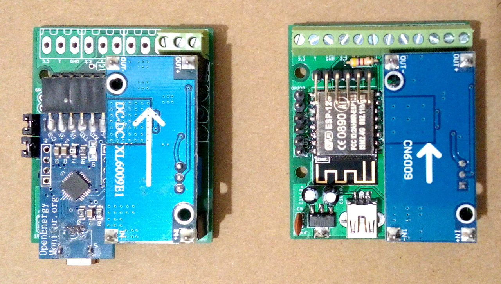
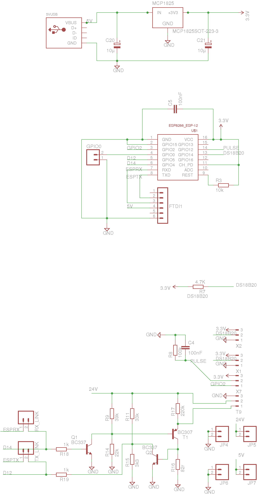
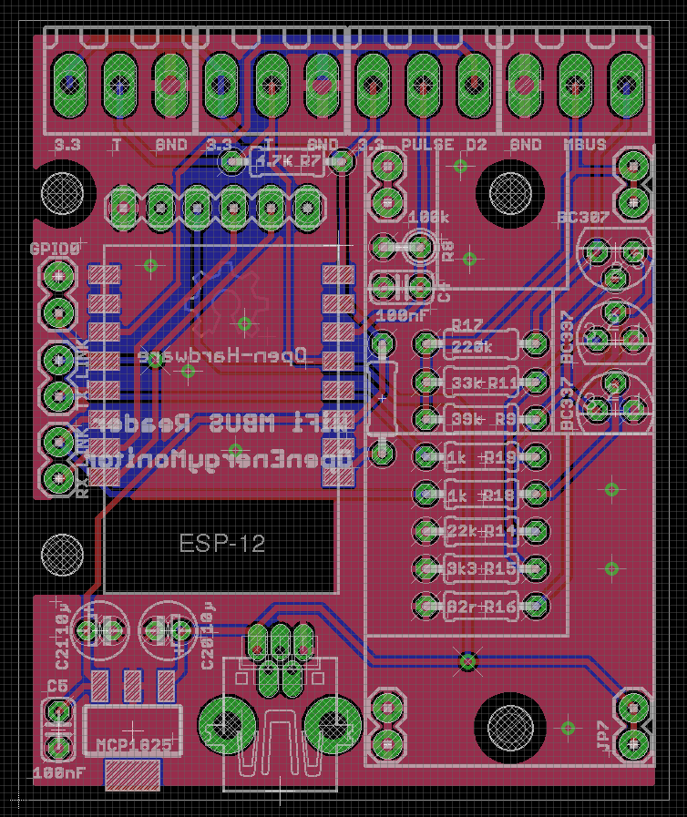

# WiFi MBUS Reader Through-Hole

If used in MBUS to UART mode, to be used with EmonHub MBUS interfacer:

https://guide.openenergymonitor.org/integrations/emonhub-interfacers/#mbus-reader-for-electric-and-heat-meters

## Schematic

[v1_TH.brd](v1_TH.brd)

## Board

[v1_TH.sch](v1_TH.sch)

The hardware design (schematics, board files and gerber) files are licensed under the [Creative Commons Attribution-ShareAlike 3.0 Unported License](http://creativecommons.org/licenses/by-sa/3.0/) and follow the terms of the [OSHW (Open-source hardware) Statement of Principles 1.0.](http://freedomdefined.org/OSHW)

