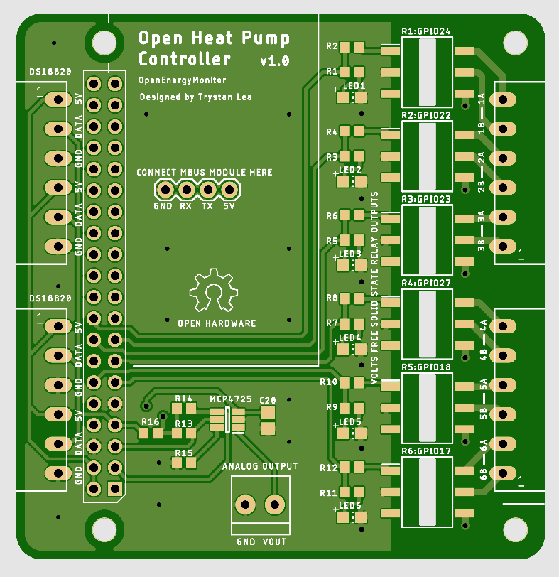

# Heatpump Controller v1

An initial board design for a heat pump controller, designed for use with a Mitsubishi EcoDan with a FTC2b controller.

This board sits on top of a RaspberryPi and the very basic at this stage python scripting that runs on it can be found here: https://github.com/TrystanLea/heatpump_control

**Features:**

- 6x solid state relay outputs either PVT312, PVT412 or LH1546. Most of these are used to switch the volts free inputs on the FTC2b, e.g heating on, DHW mode etc.
- The PVT412 can drive up to 120mA AC which is 27.6W, can directly control a couple of AC low power solenoids/valves.
- 4x DS18B20 temperature sensor connections for cylinder and outside temperature sensors
- 0-5V voltage output to set EcoDan flow temperature
- A connection for the MBUS reader module here [USB_to_MBUS](https://github.com/openenergymonitor/HeatpumpMonitor/tree/master/Hardware/USB_to_MBUS) to read from heat meters. Later version could integrate this on the board.
- The Pi can connect via an modbus reader to a SDM120 single phase electricity meter, see [OEM Guide](https://guide.openenergymonitor.org/integrations/emonhub-interfacers/#reading-from-a-sdm120-single-phase-meter)

## Alternative approach (better?)

It looks like it is possible to issue commands directly via the CN105 connector on most Mitsubushi EcoDan controllers, which looks like a better and much cheaper approach than the above. Will be trying this myself soon:

- https://github.com/SwiCago/HeatPump
- https://www.geekzone.co.nz/forums.asp?forumid=73&topicid=265469
- https://web.archive.org/web/20171007190023/https://nicegear.co.nz/blog/hacking-a-mitsubishi-heat-pump-air-conditioner/
- https://gitter.im/Mitsubishi-CN105-Protocol-Decode/community
- https://github.com/m000c400/Mitsubishi-CN105-Protocol-Decode
- https://github.com/BartGijsbers/CN105Gateway
