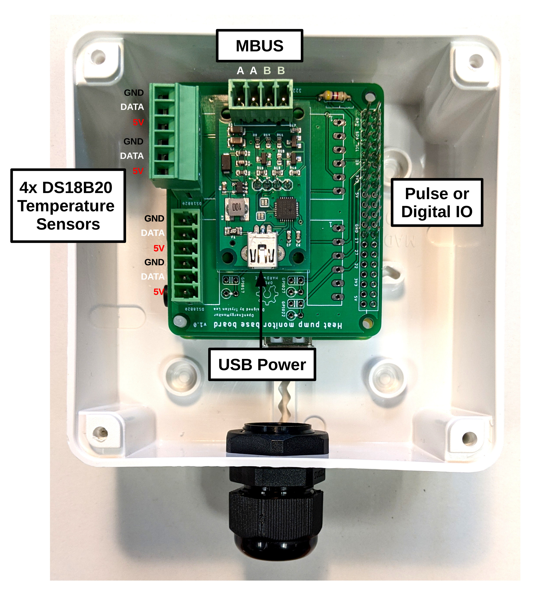
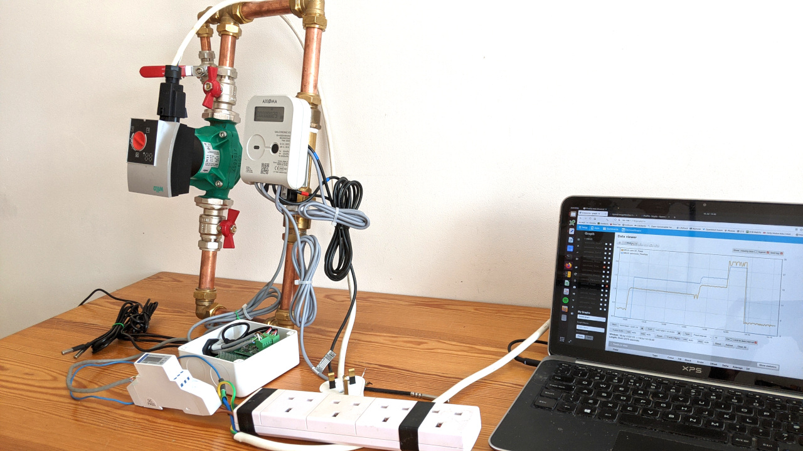

## RaspberryPi & MBUS based heat pump monitor

This is a new heat pump monitor board designed specifically for interfacing with MID standard electricity and heat meters via MBUS. It has a RaspberryPi at it’s core running our emonSD image enabling local or/and remote logging and data visualisation.

**The heat pump monitor:** This design combines a: RaspberryPi + [heat pump monitoring baseboard](baseboard) + [USB to MBUS reader](../USB_MBUS_Reader) board in a single unit.

**Features**

- MBUS Reader (Reads from connected electricity and heat meters)
- DS18B20 Temperature sensor connections
- 6 Digital input or outputs can be used for pulse counting
- I2C connection (uses 2 of the 6 digital IO's)
- RaspberryPi running the OpenEnergyMonitor emonSD image

**Connection diagram**

**Example test setup:** Reading from a SDM120-MBUS electricity meter and a Qalcosonic E3 heat meter. These, or similar meters would usually be installed as part of heat pump installation.

---

**Forum post: Reading from multiple MBUS meters with the EmonHub MBUS interfacer** 
https://community.openenergymonitor.org/t/reading-from-multiple-mbus-meters-with-the-emonhub-mbus-interfacer/18159
