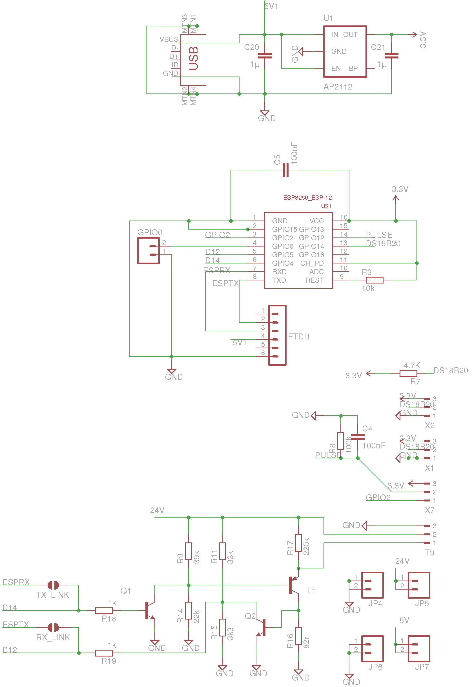

# WiFi MBUS Reader

A simple MBUS reader development board with optional WiFi based on ESP8266. Designed for reading data from heat pump heat meters and either interfacing directly with a RaspberryPi via UART or via WiFi if the ESP8266 is soldered on.

**Features**

- MBUS Reader circuit, requires external boost converter
- MBUS to UART mode without ESP8266 attached.
- MBUS to WiFi mode with ESP8266 attached.
- With ESP8266: Pulse counting & potentially reading from Elster A100c IrDa output
- With ESP8266: DS18B20 temperature sensing 

**Software**

If used in **MBUS to UART mode**, the board can be used with the EmonHub MBUS Interfacer. This interfacer is designed to look for specific useful parameters for electric and heat metering (It does not implement the full MBUS spec). It will typically return flow and return temperatures, flow rate, heat output, and cumulative heat energy for heat meters that support these parameters.

https://guide.openenergymonitor.org/integrations/emonhub-interfacers/#mbus-reader-for-electric-and-heat-meters

The software for the **MBUS to WiFi mode** has not been written in full yet. A basic MBUS Reader firmware tested to work on this board is available here for anyone keen to get stuck in before I get this done: https://github.com/openenergymonitor/HeatpumpMonitor/tree/master/Firmware/Arduino/MBUS_Reader_ESP 

## Schematic

[WiFi_MBUS_Reader.brd](WiFi_MBUS_Reader.brd)

## Board

[WiFi_MBUS_Reader.sch](WiFi_MBUS_Reader.sch)

The hardware design (schematics, board files and gerber) files are licensed under the [Creative Commons Attribution-ShareAlike 3.0 Unported License](http://creativecommons.org/licenses/by-sa/3.0/) and follow the terms of the [OSHW (Open-source hardware) Statement of Principles 1.0.](http://freedomdefined.org/OSHW)

