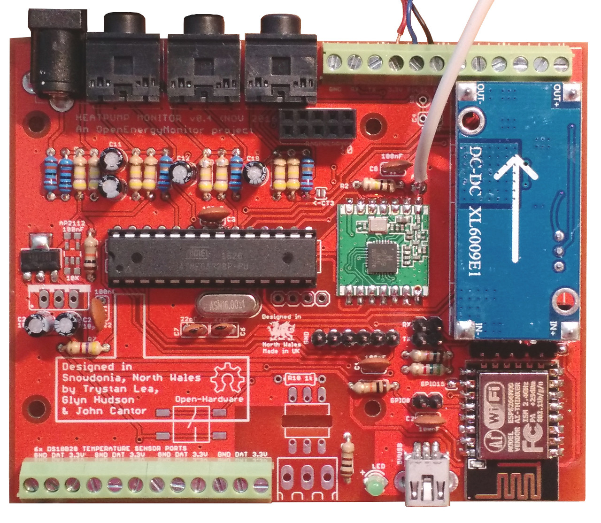

# Heatpump Monitor Build

The heatpump monitor comes as a component kit with all the resistors, capacitors, connectors, IC's and other parts required to complete the build. The full Bill of Materials can be found [here](https://github.com/openenergymonitor/HeatpumpMonitor/blob/master/costingexample.md)

**Voltage Regulator Update:** The voltage regulator has been updated to a surface mount voltage regulator see updated assembled close-up below.

**Resistor reference**

The following resistors are included in the kit.

<table cellspacing="0" border="0">
	<colgroup width="63"></colgroup>
	<colgroup width="219"></colgroup>
	<colgroup width="162"></colgroup>
	<colgroup width="245"></colgroup>
	<tr>
		<td height="17" align="center"><b>Quantity</b></td>
		<td align="left"><b>Resistance</b></td>
		<td align="left"><b>Colour code</b></td>
		<td align="left"><b>Function</b></td>
	</tr>
	<tr>
		<td height="17" align="center" sdval="8" sdnum="2057;">8</td>
		<td align="left">470k (5%)</td>
		<td align="left">Yellow-purple-yellow</td>
		<td align="left">CT + ACAC Voltage dividers</td>
	</tr>
	<tr>
		<td height="17" align="center" sdval="1" sdnum="2057;">1</td>
		<td align="left">120k (blue, 1%)</td>
		<td align="left">Brown-red-black-orange</td>
		<td align="left">ACAC voltage divider top</td>
	</tr>
	<tr>
		<td height="17" align="center" sdval="1" sdnum="2057;">1</td>
		<td align="left">10k (blue, 1%)</td>
		<td align="left">Brown-black-black-red</td>
		<td align="left">ACAC voltage divider bottom</td>
	</tr>
	<tr>
		<td height="17" align="center" sdval="1" sdnum="2057;">3</td>
		<td align="left">10k (5%)</td>
		<td align="left">Brown-black-orange</td>
		<td align="left">Mixed use</td>
	</tr>
	<tr>
		<td height="17" align="center" sdval="1" sdnum="2057;">1</td>
		<td align="left">4.7k (5%)</td>
		<td align="left">Yellow-purple-red</td>
		<td align="left">DS18B20 Temperature sensing</td>
	</tr>
	<tr>
		<td height="17" align="center" sdval="1" sdnum="2057;">1</td>
		<td align="left">100k (5%)</td>
		<td align="left">Brown-black-yellow</td>
		<td align="left">Pulse counting dropdown</td>
	</tr>
	<tr>
		<td height="17" align="center" sdval="1" sdnum="2057;">1</td>
		<td align="left">100R (5%)</td>
		<td align="left">Brown-black-brown</td>
		<td align="left">LED current limiting resistor</td>
	</tr>
	<tr>
		<td height="17" align="center" sdval="1" sdnum="2057;">1</td>
		<td align="left">5.6k (5%)</td>
		<td align="left">Green-blue-red</td>
		<td align="left">Serial 5V to 3.3V level converter</td>
	</tr>
	<tr>
		<td height="17" align="center" sdval="1" sdnum="2057;">1</td>
		<td align="left">56R (5%)</td>
		<td align="left">Green-blue-black</td>
		<td align="left">Unused for powering from ACAC*</td>
	</tr>
	<tr>
		<td height="17" align="center" sdval="3" sdnum="2057;">3</td>
		<td align="left">CT burden resistors (1%)</td>
		<td align="left">see note</td>
		<td align="left"> </td>
	</tr>
	<tr>
		<td height="17" align="center" sdval="1" sdnum="2057;">1</td>
		<td align="left">220k (5%)</td>
		<td align="left">Red-red-yellow</td>
		<td align="left">MBUS Reader</td>
	</tr>
	<tr>
		<td height="17" align="center" sdval="1" sdnum="2057;">1</td>
		<td align="left">33k (5%)</td>
		<td align="left">Orange-orange-orange</td>
		<td align="left">MBUS Reader</td>
	</tr>
	<tr>
		<td height="17" align="center" sdval="1" sdnum="2057;">1</td>
		<td align="left">39k (5%)</td>
		<td align="left">Orange-purple-orange</td>
		<td align="left">MBUS Reader</td>
	</tr>
	<tr>
		<td height="17" align="center" sdval="1" sdnum="2057;">1</td>
		<td align="left">22k (5%)</td>
		<td align="left">Red-red-orange</td>
		<td align="left">MBUS Reader</td>
	</tr>
	<tr>
		<td height="17" align="center" sdval="1" sdnum="2057;">1</td>
		<td align="left">3k3 (5%)</td>
		<td align="left">Orange-orange-red</td>
		<td align="left">MBUS Reader</td>
	</tr>
	<tr>
		<td height="17" align="center" sdval="1" sdnum="2057;">1</td>
		<td align="left">82R (5%)</td>
		<td align="left">Grey-red-black</td>
		<td align="left">MBUS Reader</td>
	</tr>
	<tr>
		<td height="17" align="center" sdval="2" sdnum="2057;">2</td>
		<td align="left">1k (5%)</td>
		<td align="left">Brown-black-red</td>
		<td align="left">MBUS Reader</td>
	</tr>
</table>

Component values including resistor resistance and capacitor capacitance are printed on the PCB. See resistor color code graphic here to help with matching the resistors [images/resistor-color-chart.jpg](images/resistor-color-chart.jpg).

Several of the resistors only have a reference name printed, the following are all part of the CT sensor and ACAC sensor biasing circuits and are all 470k resistors (470k (yellow-purple-yellow) was historically choosen to increase battery lifespan in battery powered nodes - lower values down to around 10k could be choosen instead here for a more stable biasing voltage):

    VDT: Voltage Divider Top (for AC-AC Voltage sensor)
    VDB: Voltage Divider Bottom (for AC-AC Voltage sensor)
    VDT1: Voltage Divider Top 1 (for CT sensor 1)
    VDB1: Voltage Divider Bottom 1 (for CT sensor 1)
    VDT2: Voltage Divider Top 2 (for CT sensor 2)
    VDB2: Voltage Divider Bottom 2 (for CT sensor 2)
    VDT3: Voltage Divider Top 3 (for CT sensor 3)
    VDB3: Voltage Divider Bottom 3 (for CT sensor 3)

**CT Burden resistors:**

The included burden resistor is 100 Ohms, this provides a AC power measurement range of **0 - 5.4 kW**. A smaller burden resistor can be used instead for larger measurement range at lower resolution, 22 Ohms would provide 0 - 24 kW range. See Building Blocks guide [CT sensors - interfacing with arduino](https://openenergymonitor.org/emon/buildingblocks/ct-sensors-interface)

Example calculation:

    Max Power = (((VREF ÷ 2) ÷ Burden resistance) × CT turns) × 230V ÷ sqrt(2)
    Max Power = (((3.3V ÷ 2) ÷ 100R) × 2000 turns) × 230V ÷ sqrt(2) 
    Copy into calculator: (((3.3÷2)÷100)×2000)×230÷sqrt(2) 

Burden resistor PCB name reference:

    BUR1: Burden resistor 1 (for CT sensor 1)
    BUR2: Burden resistor 2 (for CT sensor 2)
    BUR3: Burden resistor 3 (for CT sensor 3)
    
Capacitors: C11, C13, C12, C19 all 10uF

The following image can also be used as a reference of component locations. 
    

**Tip 1:** It is usually easier to start by soldering the lower profile components first such as the resistors and to build up to the taller components. 

**Tip 2:** Test that the ATmega328 part works first before soldering in the ESP8266 module so that any issues with the ATmega328 part can be isolated before adding the ESP WIFI part. 

Check that the power supply voltages are all as expected before inserting the ATmega328 in the 28pin holder.

**ESP8266 Supply capacitor:** An additional 10uF may be required across the supply to the ESP8266 module. The ground is top-left and 3.3v top-right. Adding this capacitor solved an issue with the unit resetting regularly - indicating a power supply issue.

**ESP CH_PD and GPIO15 Solder jumpers** Both of these solder jumpers need to be connected with a small blob of solder for the ESP module to work.

### Uploading the ATmega328 Firmware

The default heatpump monitor firmware can be found here: [https://github.com/openenergymonitor/HeatpumpMonitor/tree/master/Firmware/Arduino/HeatpumpMonitor_AutoTemp](https://github.com/openenergymonitor/HeatpumpMonitor/tree/master/Firmware/Arduino/HeatpumpMonitor_AutoTemp)

Use a USB to UART programmer connected to the 6-way UART header closest to the ATmega328 to upload this firmware using the Arduino IDE.

If you're using the cable sold through the OpenEnergyMonitor Shop, the drivers for Windows and Mac can be downloaded here: [http://www.silabs.com/products/mcu/Pages/USBtoUARTBridgeVCPDrivers.aspx](http://www.silabs.com/products/mcu/Pages/USBtoUARTBridgeVCPDrivers.aspx)

The Heatpump Monitor repository contains all the Arduino libraries required to compile the heatpump monitor firmware. Once the Ardunio IDE is installed it can be configured to use these libraries by going to: **File > Preferences** and setting the sketchbook location to **HeatpumpMonitor/Firmware/Arduino** (including the full path to your HeatpumpMonitor folder on your system).

### Uploading the ESP8266 Firmware: EmonESP

The EmonESP ESP8266 Firmware and upload guide can be found here: [https://github.com/openenergymonitor/EmonESP](https://github.com/openenergymonitor/EmonESP)

**GPIO0 Jumper:** Place a jumper across the GPIO0 header just left of the ESP8266 module to place the ESP8266 module in bootloader mode. Power cycle the board to reset the ESP8266 module. Once the firmware is uploaded remove the GPIO0 jumper so that the ESP8266 starts up without going into bootloader mode at the next power cycle.
