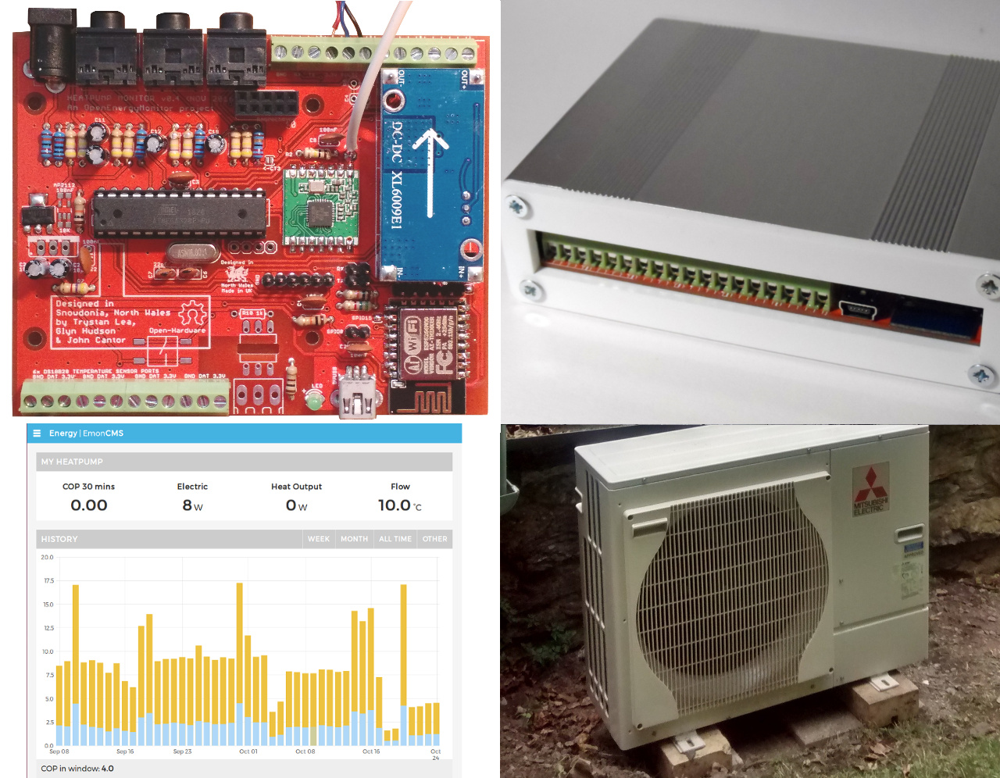
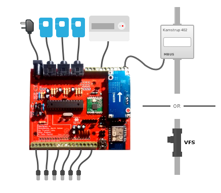

# Heatpump Monitor

This is the technical github repository for the open hardware and software heat-pump performance monitor, part of a wider heat-pump monitoring project by OpenEnergyMonitor.org and John Cantor of heatpumps.co.uk.

This is a web-connected open source hardware heat-pump monitor that can measure heat-pump electrical input, heat output and system temperatures. Alongside open source web software for heat-pump data visualisation, analysis and sharing of open heat-pump data.

## Content

- Monitoring a heatpump
- System setup
- Hardware
- Firmware
- Web Dashboard

## Rationale

Heat-pumps are a key component of zero carbon energy systems making it possible to provide heating efficiently from renewable energy, they are featured in many zero carbon energy scenarios such as ZeroCarbonBritain developed by the Centre for Alternative Technology and are also highlighted in David MacKay's book Sustainable Energy without the hot air.

By monitoring a heat-pump its possible to see how well it is working, diagnose problems and get a better understanding of how a key potentially zero carbon heating solution works, data gathered and shared from well performing systems could help de-mystify heat-pump operation and help improve performance by diagnosing any problems early.

## [Installation and setup](installation.md)

## Hardware

**Main Features:**

- MBUS reader for kamstrup heat meters
- CT current and ACAC voltage based electricity monitoring 
- Pulse counting 
- Analog inputs for Vortex Flow Sensor (VFS) option (e.g Grundfos, Sika) 
- 6x individually broken out DS18B20 temperature sensor connections 
- Arduino ATmega328 core 
- Connectivity options: ESP-12 WIFI, RaspberryPI header, RFM69 
- LCD display connector.

## Firmware

## Web dashboard

## Known Issues

- VFS requires 5V power supply, current terminals break out 3.3V, next revision needs 5V routed instead.
- Increase the thickness of the 3.3V supply lines to the ESP12 Wifi.
- RaspberryPi model B+ Ethernet port position overlaps board.
- 

## Further development

- Invesigate possibility of adding small solid state relay for volts free heating system control
- Invesigate SMT LCD options
- Battery backed memory for kWh values
- Real time clock
- SD card, or on Pi Zero
- Higher capacity microcontroller
- Modbus or other electricity meter reader
- Status LED's
- Wiring up can currently be a little fiddly, a custom enclosure design could make installation and debugging easier.
- Auto reset ESP12 on each upload stage

## Licence

This project is open source software and hardware.

The Arduino firmware is available under the GPL v3 Licence. 

The Web Dashboard is available under the GNU Affero General Public License and is based on emoncms.

The hardware design (schematics, board files and gerber) files are licensed under the [Creative Commons Attribution-ShareAlike 3.0 Unported License](http://creativecommons.org/licenses/by-sa/3.0/) and follow the terms of the [OSHW (Open-source hardware) Statement of Principles 1.0.](http://freedomdefined.org/OSHW)
