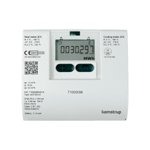
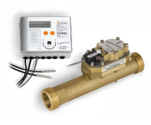
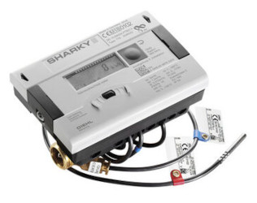
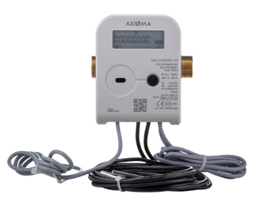
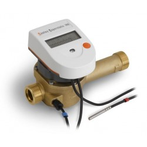
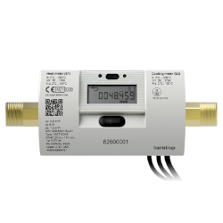

# Selecting the right heat meter

There are a number of different heat meter brands and models available that are both MID and RHI (UK Renewable Heat Incentive) approved. If you are in the UK, Stockshed provide a good range of these meters: [https://stockshed.com/pages/heat-meters-stockshed-uk](https://stockshed.com/pages/heat-meters-stockshed-uk).

Most heat meters include an MBUS interface that can be used for reading the metering data. This usually includes, total heat delivered in kWh, real-time heating power in Watts, flow and return temperatures and flow rate in L/min of m3/hr. 

Using an MBUS reader connected to an emonPi, emonBase or just a Raspberry Pi, it is possible to read in this data and then store and visualise it using emoncms. Combined with electricity data, this can provide a data rich, detailed view of the performance of a heat pump.

So far, we have only tested our MBUS reader software with a subset of the following meters but they should all be compatible, if not out of the box, with a little modification of the code. Please email me at trystanlea @ openenergymonitor.org if you are having trouble reading from a particular MBUS meter.

**Important:** We recommend using meter's with an AC power supply option as most battery powered options are not designed for requesting MBUS data at 10s frequency and so battery life may be much shorter than otherwise advertised. 

### [Kamstrup MULTICAL 403](https://www.kamstrup.com/en-en/heat-solutions/meters-devices/meters/multical-403)

<table><tr><td></td><td>

- Tested at OpenEnergyMonitor: Yes
- Class 2, MID approved
- Ultrasonic
- Not compatible with glycol (to our knowledge)
- Power supply: Mains AC and battery powered options
- [Technical description pdf](https://documentation.kamstrup.com/docs/MULTICAL_403/en-GB/Data_sheet/CONT0B6D945665A843D6A9B8B14FC05A203B/) does suggest long battery lifetimes with wired M-Bus at 10s data rates - "By using M-Bus, the meter obtains a battery lifetime of up to 16 years with meter readings via the module every 10 seconds."
- Flow measurement cycle: 1s (fast), 4s (normal), 1-4s (adaptive)
- Temperature measurement cycle: 4s (fast), 32s (normal), 4-64s (adaptive, appears to be default)
- Standard configuration from stockshed is heating only, heating and cooling configuration is available.
        
</td></tr></table>
        
### Sontex Superstatic 440

<table><tr><td></td><td>

- Tested at OpenEnergyMonitor: Yes
- Class 2, MID approved
- Fluid oscillator, piezo electric
- **Glycol calibration available**
- Power supply: **Mains AC** and battery powered options. AC power is recommended for high resolution 10s data. (M-Bus is not self-powered)
- Flow measurement cycle: continuous
- Temperature measurement cycle: 3s (mains), 20s (d-cell battery), 30s (c-cell battery)

</td></tr></table>

### Diehl Metering Sharky 775

<table><tr><td></td><td>

- Tested at OpenEnergyMonitor: Yes, see [forum post](https://community.openenergymonitor.org/t/newbie-hardware-question/16242/31) 
- Class 2, MID approved
- Ultrasonic
- Not compatible with glycol (to our knowledge)
- Power supply: **Mains AC** and battery powered options. AC power is recommended for high resolution 10s data
- Flow measurement cycle: 1/8 s (mains), 1s (battery)
- Temperature measurement cycle: 2s (mains), 4s (d-cell battery), 15s (a-cell battery)
- Max MBUS read interval: A-cell: 3 minutes, D-cell: 1 minute?, Mains supply: unlimited
        
</td></tr></table>

### Axioma Qalcosonic E3

<table><tr><td></td><td>

- Tested at OpenEnergyMonitor: Yes, for Richard Boyd at [You Generate](https://www.yougenerate.co.uk/)
- Class 2, MID approved
- Ultrasonic
- Not compatible with glycol (to our knowledge)
- Power supply: **Mains AC** and battery powered options. AC power is recommended for high resolution 10s data
- Flow measurement cycle: 1s (0.125s test mode)
- Temperature measurement cycle: 10s (1s test mode)    
        
</td></tr></table>
    
### Sontex Superstatic 749

<table><tr><td></td><td>

- Tested at OpenEnergyMonitor: No
- Class 2, MID approved
- Fluid oscillator, piezo electric
- **Glycol calibration available**
- Power supply: Battery powered (6 or 12 year battery life options). The M-Bus version is powered via the M-Bus line meaning high resolution 10s data does not impact the battery
- Flow measurement cycle: continuous
- Temperature measurement cycle: 10s
        
_(The Superstatic 789 is a slightly cheaper version of the 749 with a plastic body)_

</td></tr></table>

### Kamstrup multical 302

<table><tr><td></td><td>

- Tested at OpenEnergyMonitor: No
- Class 2, MID approved
- Ultrasonic
- Not compatible with glycol (to our knowledge)
- Power supply: Battery powered only, 6 or 12 year battery life options
- Flow measurement cycle: 1s (fast), 4s (normal), 1-4s (adaptive)
- Temperature measurement cycle: 4s (fast), 32s (normal), 4-64s (adaptive)
        
</td></tr></table>

---

# Heat meter pressure loss

Written by John Cantor, see [original blog post](https://heatpumps.co.uk/2016/06/08/selecting-the-right-heat-meter)

This topic is **VERY IMPORTANT**

I am aware that the pressure requirements of heat meters is often overlooked - this can be detrimental to a heat pump system.

A heat pump will normally be connected to a radiator or underfloor heat-emitter circuit.  A circulation pump (circulator) is required to ‘force’ the water around this circuit.  Each part of the pipework and each components acts as a restriction to flow. The greater the restriction, the bigger the circulation pump needed.  Indeed, many systems have 2 or more circulators, whilst it should be possible to only have one.

Heat meters  (reading heat in Kw’s) are often required to calculate RHI payments. The main component of a heat meter is a device fitted in a pipe to measure the liquid flowrate through the system. This device will cause a restriction to flow. However, it would be ridiculous for our heat-measuring device to impair energy-efficiency by either causing an inadequate liquid flow-rate, or by increasing circulation pump energy demand.

Let us get a ‘feel’ of the pressures involved. Metres head (height) of water is a good understandable unit of pressure measurement, but several other units are used;

    1 bar pressure (about 1 atmosphere)  = 10.2m head of water = 1,000mB = 100kPa

Most common circulation pumps can produce a maximum of 5 or 6 metres water head  (0.5 to 0.6 bar), however, this is at the pump’s low flow-rate.  For energy-efficient operation, we should operate them at mid-pressure range, ideally no more than a pressure of 2.5m head of water to work against.
Some heat pumps have one circulator to circulate through the heat pump and the emitters.  If the heat pump requires say 1m water head for its required flow-rate, and the emitter circuit requires a further 1m head, then the circulation pump needs to exert a total pressure of 2m head. There is little pressure left  to overcome restrictions for a the heat meter, so the heat meter should not be too restrictive.    Even if your system has 2 circulators, the head meter should not cause a significant restriction so you must SELECT THE CORRECT METER.

At their rated flow-rate, some  heat meters will require high pressure for circulation. Some cheaper options can require up to 2.5m head pressure. This is a lot.   However, if a larger heat meter is chosen, its pressure drop can be very low since, for example,  if you halve the flow-rate, you quarter the pressure requirements. Modern meters can retain high accuracy even at very low flow rates. E.g. if your system flow is 1 cubic m / hour, your best low-pressure option might be to fit a 2.5 cubic m/hr device.

The example chart  below show how the pressure drop can be very low if the meter is used at a flow-rate well below its maximum.   Note also that some meters are inherently more ‘restrictive’ than others.   The colours are my own opinion, and relate to adding a heat meter to a heat pump system.

*Chart updated 13 September 2021 to include more heat meters*

The Vortex Flow Sensors have exactly the same issue, and there are fewer pressure ranges to choose from.  However, in the region of 25% of their rated capacity, the pressure drop is usually nice and low.

The message here is – Don’t fit a meter without assessing the pressure drop at your expected flow rate.  Don’t necessarily trust the meter supplier since they don’t all understand the energy loss implications related to heat pumps, and may want to sell you the cheapest option. It could be perfectly acceptable using a high/medium pressure drop heat meter on a biomass district heating system feeding radiators, but for heat pump applications, we could be running into trouble unless the pressure drop is low.

**Calculating pressure drop at different flow rates**

Using the simple K value method the pressure drop in bar at any given flow rate can be estimated with the following equation:

    Pressure drop = (flow rate / Kv)^2
    
K values can ususally be obtained from the meter's datasheet. If the K value is not given but a nominal flow rate and pressure drop is present, the K-value can be calculated by re-arranging the above equation:

    Kv = nominal flow rate / sqrt(pressure drop)
    
The spread sheet used to generate the above pressure loss table can be downloaded here: [heat_meter_pressure_drops.ods](images/heat_meter_pressure_drops.ods)
