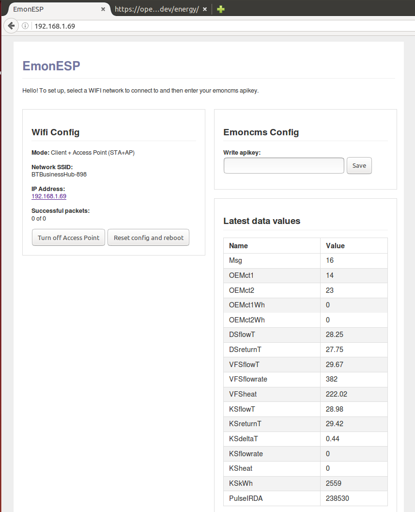
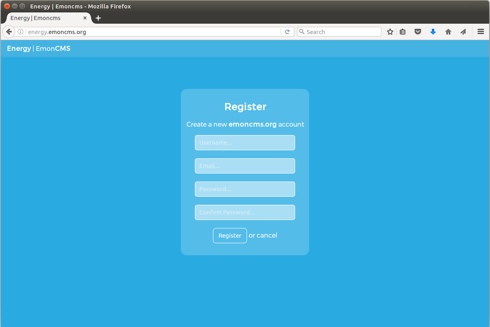
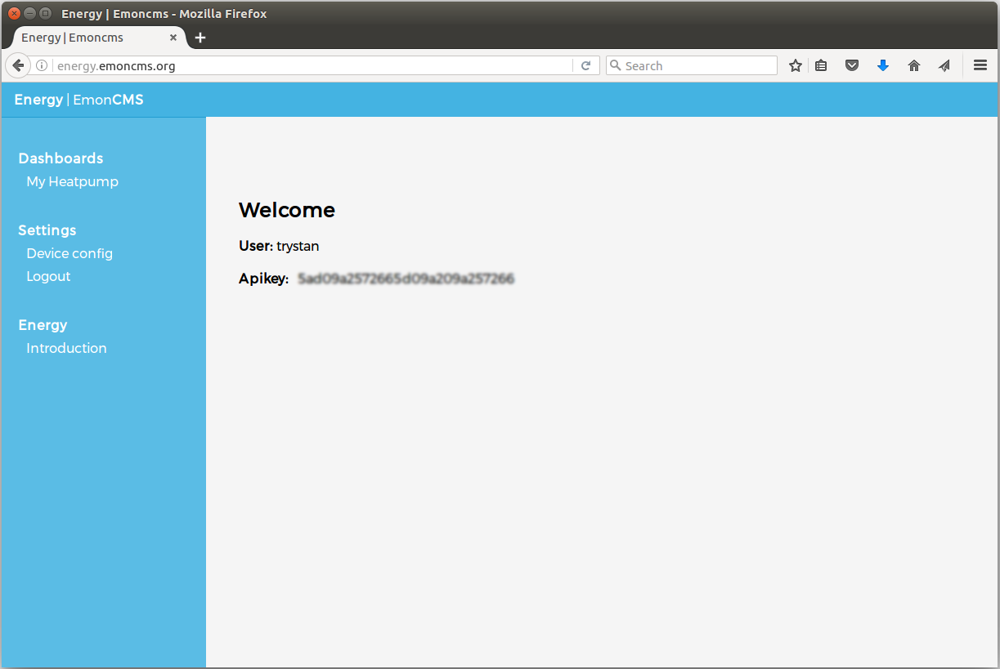
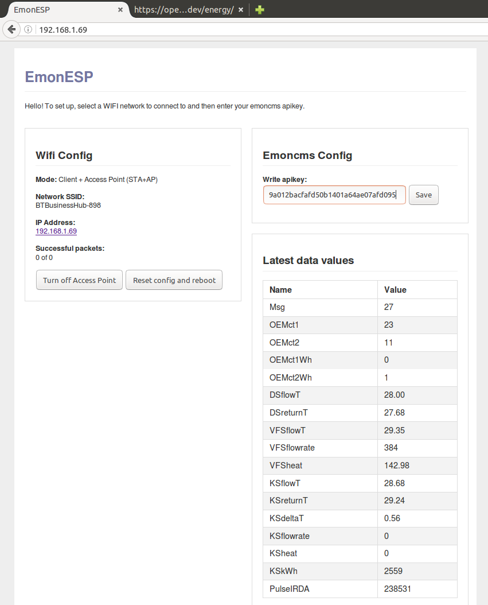
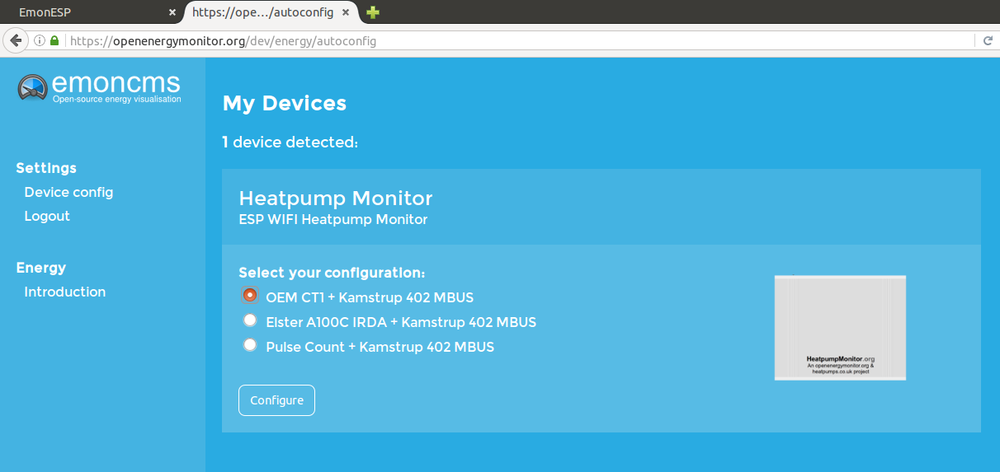
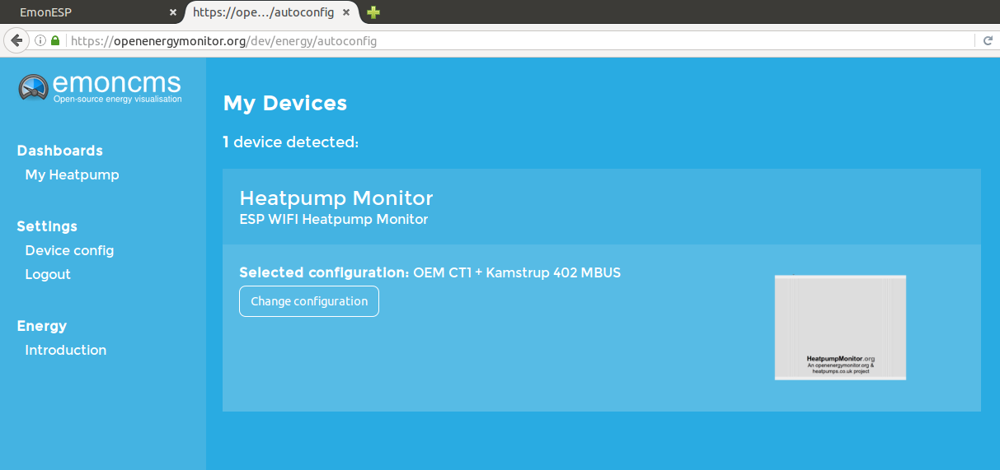
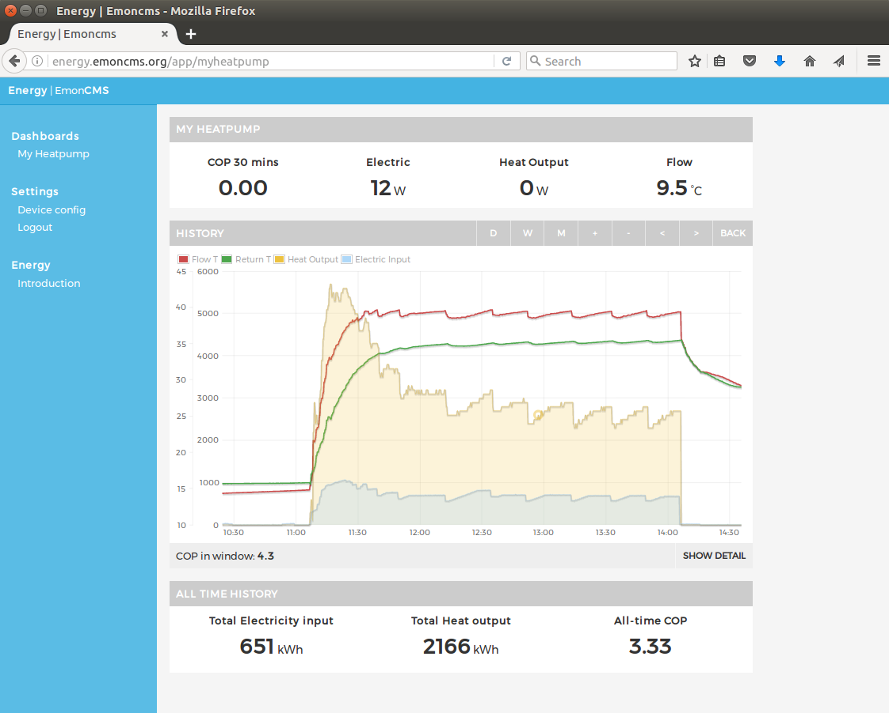
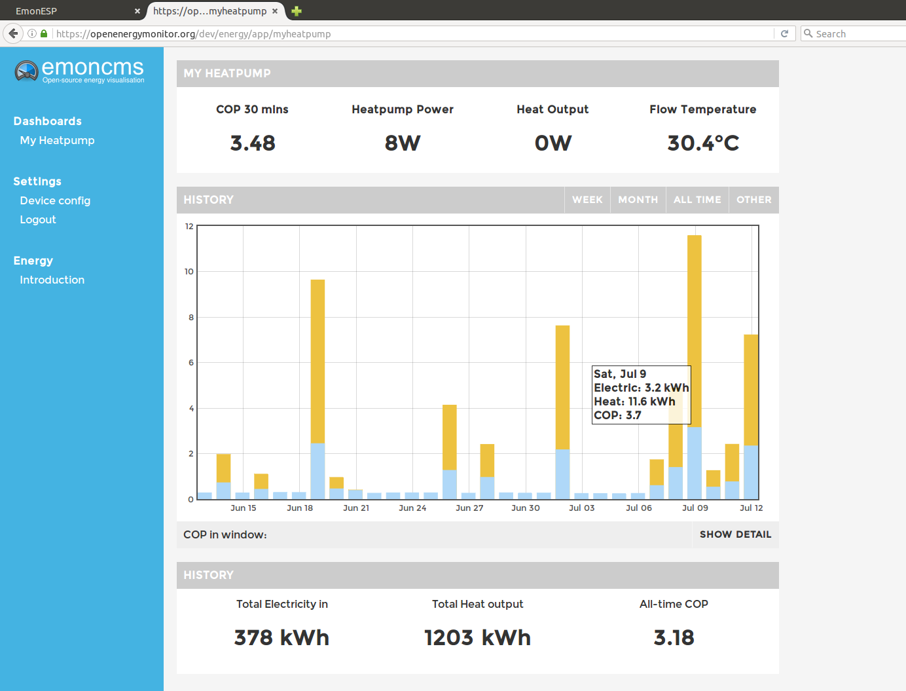
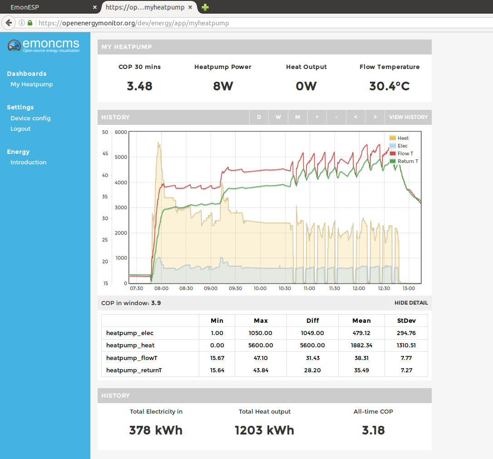

# Heat pump Monitor software setup

When the Heat pump Monitor first powers up it will create a WIFI access point. Check for this access point in the WIFI networks list on your computer. The network name will likely start with AI-THINKER or ESP. Connect to the access point and navigate to **192.168.4.1**

Select the WIFI network you wish to connect the Heat pump Monitor up to and enter the WIFI passkey. If the connection is successful the IP Address of the heat pump monitor on the local network will be shown. Click on this IP Address to use it then disconnect your computer from the access point and reconnect as normal to your home router. Navigate to the IP Address of the heat pump monitor as found in the last step.

The next section uses emoncms energy a new and still in early development front-end website that runs on top of emoncms focusing on ease of use and application specific dashboards.

Emoncms energy can be found here:

[http://openenergymonitor.org/dev/energy](http://openenergymonitor.org/dev/energy)

If you haven’t already done so, register a new emoncms user:

Once logged in copy the apikey displayed on the welcome page and paste into the EmonESP apikey input box, see second image below.

Paste the apikey into the EmonESP apikey input box and click save.

Navigate back to emoncms energy and click on *Device config* in the left hand sidebar. Select the heat pump monitor configuration you wish to use.

This complete the configuration required. Within a few seconds a link to the My Heat pump dashboard should appear top-left. 

Open the My Heat pump dashboard, after a few seconds and with a page refresh data should start to appear on the dashboard.

After an extended period of logging the dashboard will by default show the daily view showing daily electricity input and heat output over the period selected. 

Click on a particular day to see electricity, heat, flow and return temperatures for the day.

